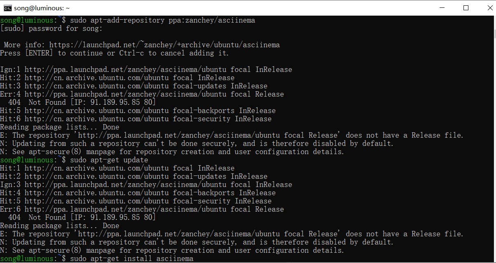
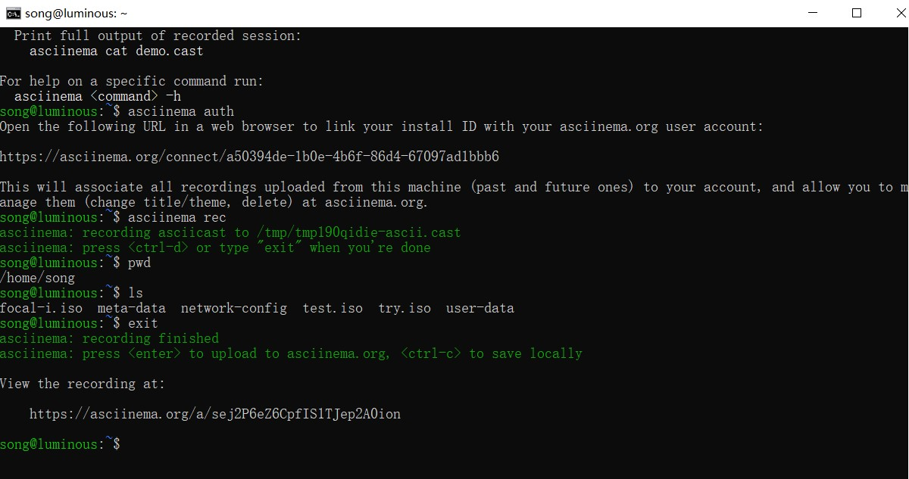

# 实验目的

- 学习vim的使用

# 实验任务

1. 下载配置asciinema软件
2. 完成vimtutor学习，并用asciinema录制学习过程
3. 完成vimtutor后的自查清单

# 实验过程

## 下载配置asciinema

根据asciinema官网中的教学方法，下载asciinema



安装asciinema后，输入下方命令，而后复制网址到浏览器中完成asciinema本地账号和在线账号的关联

```
asciinema auth
```



## vimtutor学习过程

Lesson1.1-Lesson1.4

[](https://asciinema.org/a/8Y6lnd4kRUoJfbdPrWGB4k0ag)

Lesson1.5

[](https://asciinema.org/a/rQK6xyJKFXARUTUrfzvTeQeyo)

Lesson2.1-Lesson2.4

[](https://asciinema.org/a/lduKUEVrcx07xmikqi48fUhwU)

Lesson2.5-Lesson2.7

[](https://asciinema.org/a/Syuh6y9KNs8atqE9MbDDVPKnl)

Lesson3.1-Lesson3.3

[](https://asciinema.org/a/vsaxBX90KkgBe7ghpfvlhCzwp)

Lesson3.4-Lesson4.2

[](https://asciinema.org/a/fv4q7m2AmQaC3vSqt7gdre6gf)

Lesson4.3-Lesson5.2

[](https://asciinema.org/a/U6gfpN2MKDjSkw6CLma0JdNkK)

Lesson5.3-Lesson5 summary

[](https://asciinema.org/a/U6gfpN2MKDjSkw6CLma0JdNkK)

Lesson6.1-Lesson6.4

[](https://asciinema.org/a/kdksYXrTgmdIGXdUI6cYsYhdm)

Lesson6.5-Lesson7.1

[](https://asciinema.org/a/y0QmoZjfakGOBRskpYr4sz2bu)

Lesson7.2-Lesson7.3

[](https://asciinema.org/a/nJjhcfV6r03aJURbGbP9K4pOP)

## 自查清单

1. vim工作模式种类
- 正常模式(normal-mode)
- 可视模式(visual-mode)
- 插入模式(insert-mode)
- 命令模式(command-mode)

2. 数字+Ctrl-D 光标可以向下移动指定行数；G 光标移动到文件结束行，gg 光标移动到文件开始行；输入行号+gg可以快速转跳到行号所在位置

3. 
|  键入字符   | 作用  |
|  ----  | ----  |
| x | 删除单个字符 |
| dw  | 删除单个单词 |
| d$ | 删除到行尾| 
| dd | 删除整行 |
| ndd | 删除光标所在向下n行|

4. 
80i - 按esc就会出现80个-

5. 
u 撤销最近一次编辑操作

Ctrl-R 重做最近一次被撤销的操作

6. 
| 键入字符 | 作用|
| ---- | ----| 
| yl | 复制光标右边1个字符 |
| yh | 复制光标左边1个字符 |
| yw | 复制一个单词 |
| yy | 复制整行文本 |
| . | 实现相似操作 | 

7. 
A、a、c、i、o、r、w

8. Ctrl-G 显示当前文件位置、当前状态和所在行号

9. 
```c
/+word //搜索关键词
:set noic //设置忽略大小写
\c:/ignore\c //某次搜索忽略大小写
//搜索设置高亮
vim ~/.vimrc
set hlsearch
:wq
//再次搜索时关键词会被高亮
:s/old/new //替换当前行第一个old
:s/old/new/g //替换当前行所有old
```

10. Ctrl-o Ctrl-i

11.  将光标移动到任意() [] {} 按%光标将移动到匹配的括号上

12. :!ls 在命令前加上叹号

13. 
```c
:help w(等快捷键)
//启动vim打开多个文件分屏显示
vim -on file1 file2
//o为小写，上下分屏，n为分屏的个数
vim -On file1 file2
//O为大写，左右分屏，n为分屏个数
//在已经打开的vim中对文件分屏
:sp
ctrl + w s //上下分屏
:vsp
ctrl + w v //左右分屏
ctrl + w h //移动到光标左边的窗口
ctrl + w k  //移动到光标上边的窗口
```

# 参考资料

[vim如何进行分屏操作](https://blog.csdn.net/weixin_30666753/article/details/98186386)
