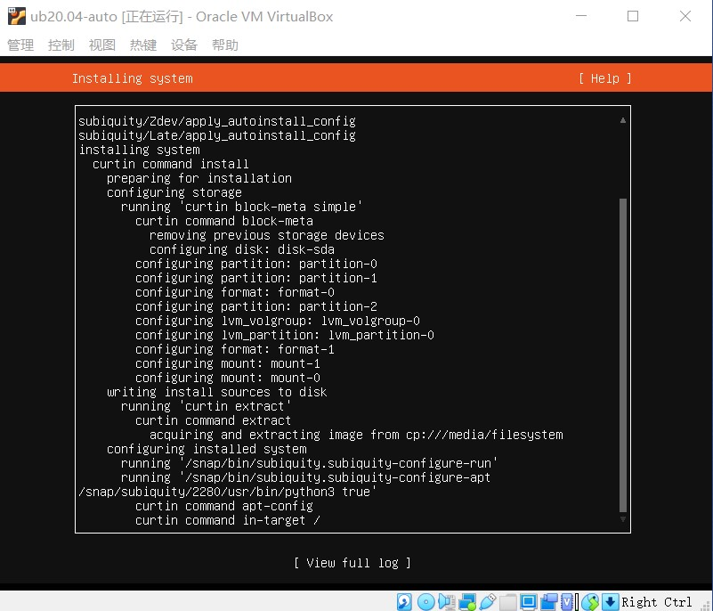
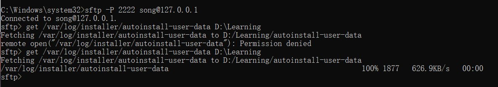
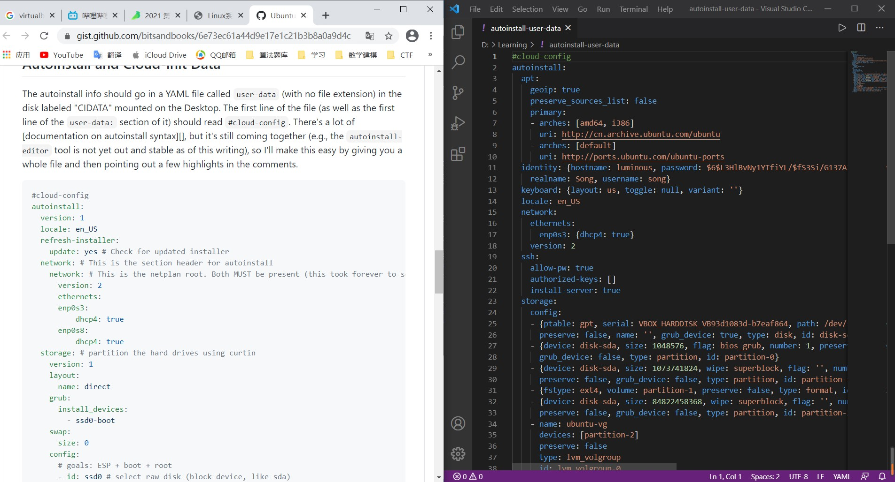
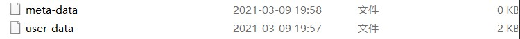
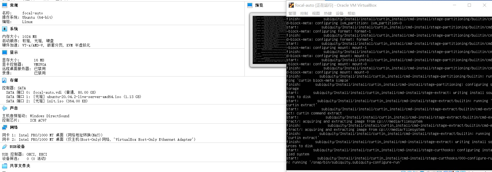
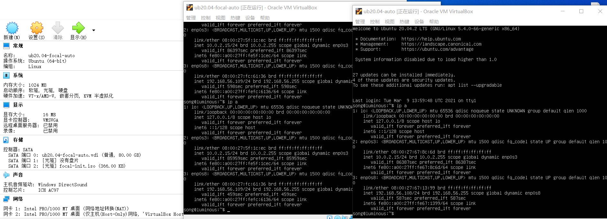
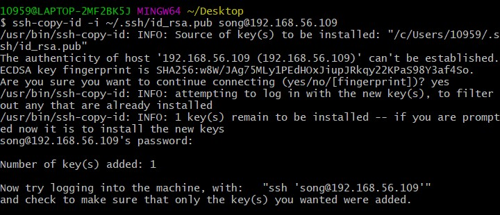
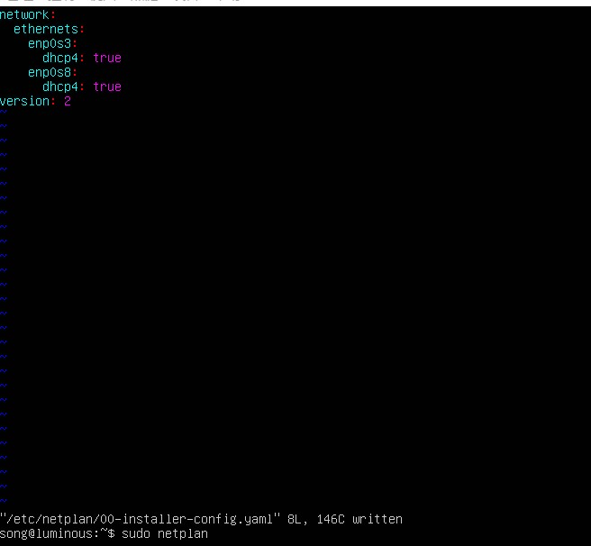

# Virtualbox无人值守安装ubuntu20.04

## 手动安装一个ubuntu20.04



## 无人值守镜像制作

1. 使用sftp将自己前期手动安装的ubuntu中的autoinstall-user-data文件传输到宿主机中，以便进行修改
```
get \var\log\autoinstall-user-date
```


2. 对照网页中的user-date以及其中的注释对自己的user-data文件进行修改



3. 在本地新建了一个空白的meta-data文件，与修改后的user-data文件一同传回到手动安转的ubuntu中

```
put D:\meta-data \home\song
put D:\user-date \home\song
```



4. 在ubuntu中安装制作镜像的软件genisoimage


5. 制作无人值守镜像并传输回宿主机
```
genisoimage -output init.iso -volid cidata -joliet -rock user-data meta-data
```

## 无人值守安装ubuntu
新建虚拟机，按操作步骤挂载光盘，启动光盘，在等待一段时间后会出现
```
Continue with autoinstall?(no/yes)
```
输入yes后，就可以直接完成无人值守安装ubuntu



无人值守安装和手动安装的对比图



## 设置免密登录

1. 生成公私钥对

Windows 在cmd中输入ssh-keygen.exe 然后连续输入回车，会自动生成公钥和私钥。

2. 将公钥上传到虚拟机

右键打开Git bash在界面中输入
```
ssh-copy-id -i ~/.ssh/id_rsa.pub username@ip
```
回车后输入虚拟机密码，即可完成ssh免密登录



## Virtualbox安装新网卡后自动获取ip地址
ubuntu20.04后开始使用netplan设置ip地址
```
sudo vim /etc/netplan/00-installer-config.yaml
//根据自己需求对文件进行修改
sudo netplan apply
```
即可完成ip地址的重新分配

# 问题
在用自己制作的无人值守镜像进行安装时，发现安装时间非常长,geogle后也没有找到合适的答案。
个人猜测可能是硬盘可用的使用空间较小？

# 参考资料
修改netplan https://blog.csdn.net/qq_43901693/article/details/103700272