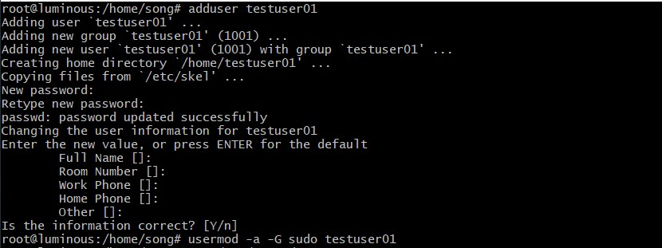
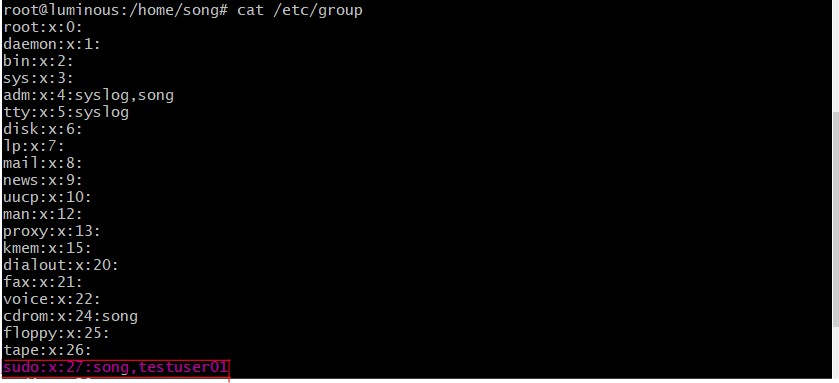
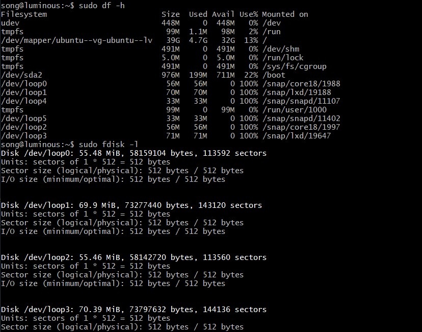

# Systemd 入门教程

# 实验内容
- 参照Systemd入门教程进行操作并录屏上传

# 实验目的
- 熟悉Systemd相关操作
- 了解文件中参数含义

# 实验环境
- Ubuntu 20.04

# 实验操作录屏

1. 3.2 hostnamectl
[](https://asciinema.org/a/e7bE8Aw7xSdXYwqtl6Rgp1EAi)

2. 3.4 localctl - 3.5 timedatectl
[](https://asciinema.org/a/qLmKvSnK75pAS9zhEqLLL0kJS)

3. 3.5 timedatactl补+ 3.6 loginctl
[](https://asciinema.org/a/9FfzUQenGIpODXzvyJgJvcrnq)

4. 4.1 Unit - 4.2 Unit status
[](https://asciinema.org/a/XBuJdldnoUF70O35lHwSbbTGZ)

5. 4.3 Unit管理 - 4.4 dependencies
[](https://asciinema.org/a/APPzucOlWO9MGzTrYUqN52Arp)

6. Unit配置文件
[](https://asciinema.org/a/Y943XgjVEKJwZTqlo5leAKz0u)

7. 六 Target - 七 日志管理
[](https://asciinema.org/a/OLah0r36wl5AQejDcAge2ueBz)

8. 实战篇
[](https://asciinema.org/a/8cVzkEZb08MyYTl91kyUy64II)

# 自查清单

1. 如何添加一个用户并使其具备sudo执行程序的权限

```
adduser user01 
usermod -a -G sudo username
```




2. 如何将一个用户添加到一个用户组

``` 
usermod -a -G groupname username
```

3. 如何查看当前系统的分区表和文件系统详细信息

```
df -h //查看文件系统详细信息
fdisk -l //查看分区表
```


4. 如何实现开机自动挂载Virtualbox的共享目录分区
```
    1. 在windows下创建一个共享文件夹
    2. 配置共享文件夹（不点击自动挂载）
    3. 在虚拟机中新建共享文件夹 /mnt/dirname
    4. 执行挂载命令 ```sudo mount -t vboxsf [Windows共享文件夹名称] /mnt/dirname```
    - 在进行这一步时出席挂载错误“mount: /mnt/xxx: wrong fs type, bad option, bad superblock on xxx...”，执行```sudo apt-get install virtualbox-guest-utils```即可
    5. 修改 /etc/fstab 文件 在文末添加```[Windows共享文件夹名称] /mnt/dirname/ vboxsf defaults 0 0```即可完成开机自动挂载
```
[](https://asciinema.org/a/9UlvDM0vDYtM1C2cqaYL99xdc)

5. 基于LVM的分区如何实现动态扩容和缩减容量
```
//把分区XXX剩余空间创建分区并改为LVM格式
fdisk XXX 

//分区扩容
lvextend -L {{size}} XXX

//分区缩减容量
lvresize --size -{{120G}} --resizefs {{volume_group}}/{{logical_volume}}
```

6. 如何通过Systemd设置实现在网络连通时运行一个指定脚本，在网络断开时运行另一个脚本

```
//修改systemd-networkd.service的配置文件
[Service]
ExecStartPost = <sh 脚本位置>
ExecStopPost = <sh 脚本位置>
//重载
sudo systemctl daemon-reload
//重启服务
sudo systemctl restart systemd-neworkd.service
```

7. 如何通过systemd设置实现一个脚本在任何情况下被杀死之后会立即重新启动，实现杀不死
```
//修改脚本服务
[Service]
Restart = always
//重载修改过的配置文件
sudo systemctl daemon-reload
```
# 问题

对于自查清单中的第六个问题不是很清楚，也没有查到可靠的答案

# 参考资料
[Systemd 入门教程：命令篇](http://www.ruanyifeng.com/blog/2016/03/systemd-tutorial-commands.html)

[Systemd 入门教程：实战篇](http://www.ruanyifeng.com/blog/2016/03/systemd-tutorial-part-two.html)

[Virtualbox实现共享文件夹并自动挂载](https://blog.csdn.net/hexf9632/article/details/93774198?utm_medium=distribute.pc_relevant.none-task-blog-baidujs_baidulandingword-0&spm=1001.2101.3001.4242)

[虚拟机VirtualBox 共享挂载问题：mount: /mnt/xxx: wrong fs type, bad option, bad superblock on xxx...](https://blog.csdn.net/weixin_34138255/article/details/91899738)

[Linux 磁盘分区表、文件系统的查看](https://blog.csdn.net/HHBBHH/article/details/5492383?utm_source=blogxgwz8)