# 实验五 Web服务器的搭建
## 实验环境
- 主机：Windows10
- 虚拟机：ubuntu 20.04

## 实验配置
### 修改Windows的hosts文件
```
192.168.56.108 vn.sec.cuc.edu.cn
192.168.56.108 wp.sec.cuc.edu.cn
192.168.56.108 dvwa.sec.cuc.edu.cn
```

### Nginx
```
#安装nginx
sudo apt update
sudo apt install nginx -y
#验证是否安装成功
sudo nginx -t
```
访问主机8080端口

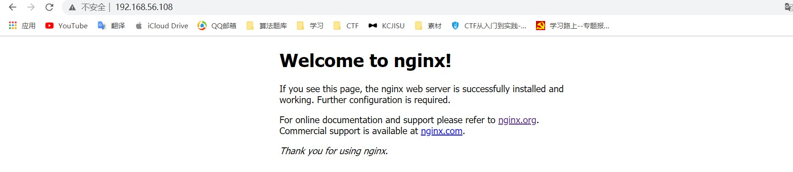

### WordPress
```
#下载相关的库
sudo apt install -y mysql-server php-fpm php-mysql
#下载完成后进入mysql新建wordpress需要的用户和数据库
sudo mysql -u root -p

# 新建一个数据库wordpress
CREATE DATABASE wordpress;

# 新建一个用户 刷新并退出
CREATE USER 'wordpressuser'@'localhost' IDENTIFIED BY 'password';
GRANT ALL ON wordpress.* TO 'wordpressuser'@'localhost';
FLUSH PRIVILEGES;
EXIT;

#安装php扩展

sudo apt install php-curl php-gd php-intl php-mbstring php-soap php-xml php-xmlrpc php-zip unzip

sudo systemctl restart php7.4-fpm

#新建文件夹保存wordpress
sudo mkdir /var/www/html/wp.sec.cuc.edu.cn/
#修改属主
sudo chown -R www-data:www-data /var/www/html/wp.sec.cuc.edu.cn/

#下载wordpress4.7安装包
sudo wget https://wordpress.org/wordpress-4.7.zip
unzip wordpress-4.7.zip
sudo cp -r wordpress/* /var/www/html/wp.sec.cuc.edu.cn/

# 拷贝配置文件
cd /var/www/html/wp.sec.cuc.edu.cn/
sudo cp wp-config-sample.php wp-config.php

#修改wp-config.php中的配置
sudo vim /var/www/html/wp.sec.cuc.edu.cn/wp-config.php
define( 'DB_NAME', 'wordpress' );

/** MySQL database username */
define( 'DB_USER', 'wordpressuser' );

/** MySQL database password */
define( 'DB_PASSWORD', 'password' );
#添加
define( 'FS_METHOD', 'direct' );

#修改配置文件
server {
    listen 8001;
    server_name wp.sec.cuc.edu.cn;
    root /var/www/html/wp.sec.cuc.edu.cn/;

    index index.php index.html index.htm index.nginx-debian.html;

    location / {
        #try_files $uri $uri/ =404;
        try_files $uri $uri/ /index.php$is_args$args;
    }
    location = /favicon.ico { log_not_found off;access_log off; }
    location = /robots.txt { log_not_found off; access_log off; allow all; }
    location ~* \.(css|gif|ico|jpeg|jpg|js|png)$ {
        expires max;
        log_not_found off;
    }
    location ~ \.php$ {
        include snippets/fastcgi-php.conf;
        fastcgi_pass unix:/run/php/php7.4-fpm.sock;
     }
}
sudo ln -s /etc/nginx/sites-available/wp.conf /etc/nginx/sites-enabled/
sudo unlink /etc/nginx/sites-enabled/default

sudo nginx -t
sudo systemctl restart nginx
```

### DVWA
```
#登录MySQL
sudo mysql -u root -p

#为dvwa创建MySQL数据库
CREATE DATABASE dvwa DEFAULT CHARACTER SET utf8 COLLATE utf8_unicode_ci;
GRANT ALL ON  dvwa.* TO 'dvwa'@'localhost' IDENTIFIED BY 'p@ssw0rd';
FLUSH PRIVILEGES;
exit;

#将DVWA源码clone到可写目录
git clone git://github.com/ethicalhack3r/DVWA 
#拷贝至/var/www/html
sudo mkdir /var/www/html/dvwa.sec.cuc.edu.cn
sudo chown -R www-data:www-data /var/www/html/dvwa.sec.cuc.edu.cn
sudo cp -r DVWA/* /var/www/html/dvwa.sec.cuc.edu.cn
cd /var/www/html/dvwa.sec.cuc.edu.cn
sudo cp /var/www/html/dvwa.sec.cuc.edu.cn/config/config.inc.php.dist /var/www/html/dvwa.sec.cuc.edu.cn/config/config.inc.php
# 更改配置文件
sudo vim /etc/nginx/sites-available/dvwa.conf
sudo ln -s /etc/nginx/sites-available/dvwa.conf /etc/nginx/sites-enabled/
server {
    listen 8002;
	server_name dvwa.sec.cuc.edu.cn;
    root /var/www/html/dvwa.sec.cuc.edu.cn;
    index index.php index.html index.htm index.nginx-debian.html;

     location / {
        #try_files $uri $uri/ =404;
        try_files $uri $uri/ /index.php$is_args$args;
    }
    location ~ \.php\$ {
        include snippets/fastcgi-php.conf;
        fastcgi_pass unix:/run/php/php7.4-fpm.sock;
    }
    location ~ /\.ht {
        deny all;
    }
}

vim /etc/php/7.4/fpm/php.ini 
allow_url_include = on
allow_url_fopen = on
display_errors = off
# 重载nginx
sudo systemctl reload nginx
```
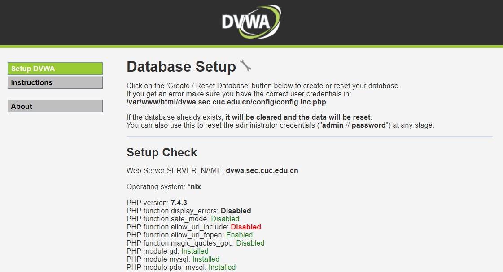

### VeryNginx
```
#先关闭nginx
sudo nginx -s stop
#安装所需要的程序
sudo apt install -y libpcre3-dev libssl-dev zlib1g-dev gcc make
#下载verynginx安装包
git clone git://github.com/alexazhou/VeryNginx.git
cd VeryNginx
#安装veryNginx
sudo python3 install.py install
# All work finished successfully, enjoy it~
#修改 /opt/verynginx/openresty/nginx/conf/nginx.conf 配置文件
sudo vim /opt/verynginx/openresty/nginx/conf/nginx.conf
# 将user从nginx修改为www-data
# 保存退出
``` 
访问主机80端口
-----------
输入用户名和密码```verynginx/verynginx```登入网站

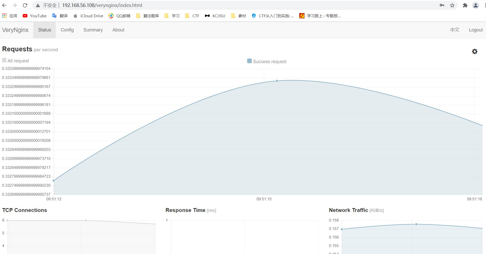

## 实验基本要求

- 使用VeryNginx反向代理WordPress，DVWA
添加Match，Proxy Pass，UpStream
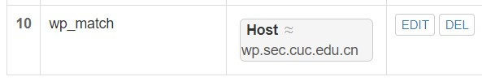
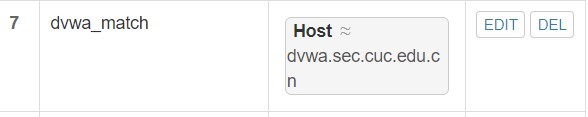
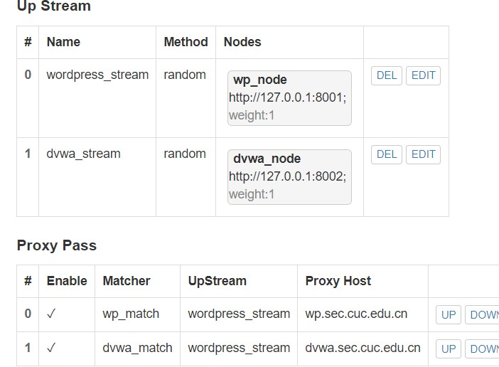

成功访问

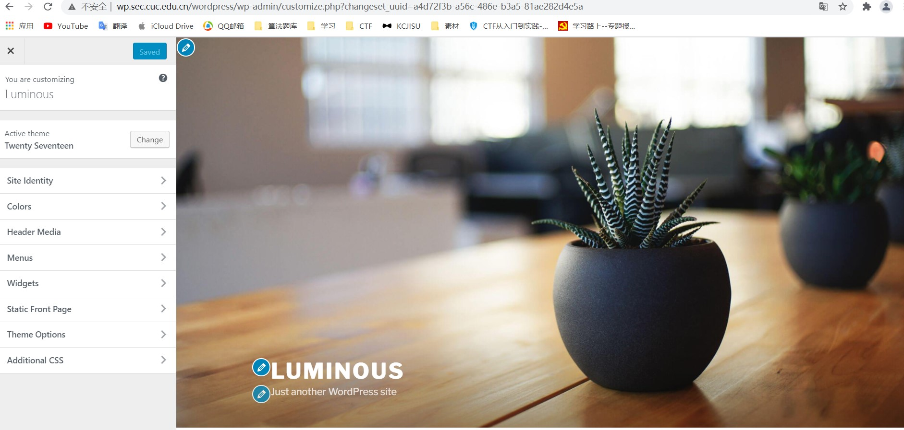
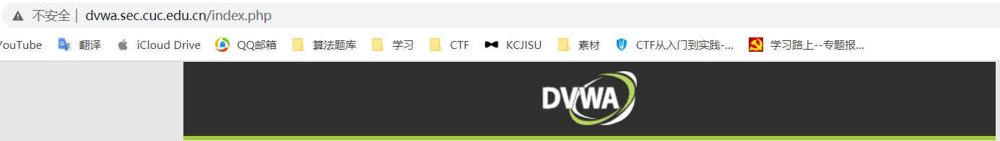

## 安全加固要求
- 使用IP地址方式均无法访问上述任意站点，并向访客展示自定义的友好错误提示信息页面-1
1. 配置match
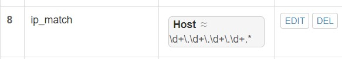
2. 设置相应response
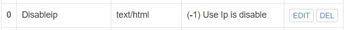
3. 设置filter阻止ip地址访问
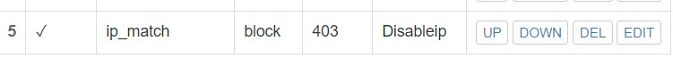


- DVWA只允许白名单上的访客来源IP，其他来源的IP访问均向访客展示自定义的友好错误提示页面-2
1. 添加matcher,ban掉自己的ip

2. 添加filter和response
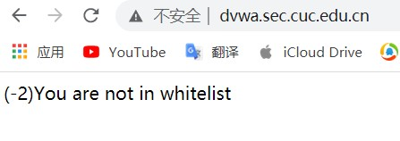

- 在不升级Wordpress版本的情况下，通过定制VeryNginx的访问控制策略规则，热修复Wordpress<4.7.1 - Username Enumeration

1. 漏洞介绍
利用该漏洞攻击者可以在未授权状态下获取之前发布过文章的用户的用户名、id 等信息

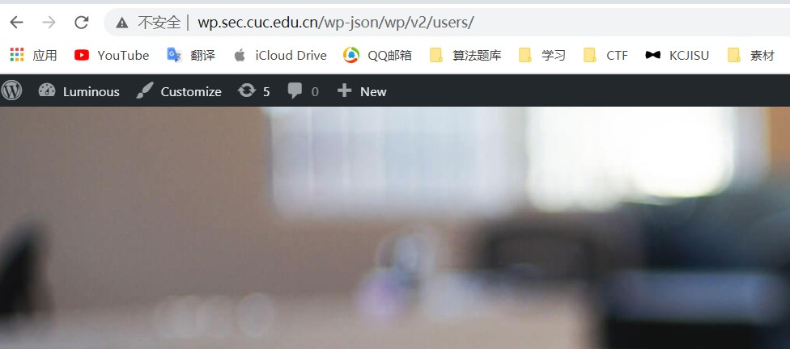

- 通过配置VeryNginx的Filter规则实现对Damn Vulnerable Web Application (DVWA)的SQL注入实验在低安全等级条件下进行防护
1. 正常注入
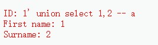

2. 设置matcher，禁止union，select等sql注入常用字符串
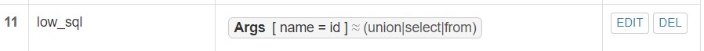
3. 设置response和Filter
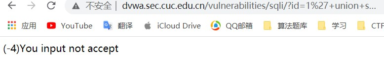

## VeryNginx配置要求
- VeryNginx的Web管理页面仅允许白名单上的访客来源IP，其他来源的IP访问均向访客展示自定义的友好错误提示信息页面-3

1. 设置matcher
```
ip = whitelist ip
Host = vn.sec.cuc.edu.cn
uri = /verynginx/index.html
```
2. 设置response和Filter

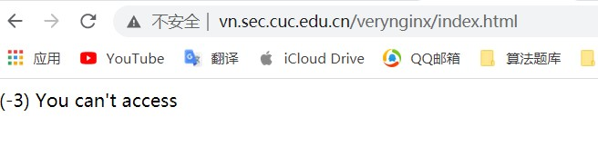

- 通过定制VeryNginx的访问控制策略规则实现：
    - 限制DVWA站点的单IP访问速率为每秒请求数 < 50
    - 限制Wordpress站点的单IP访问速率为每秒请求数 < 20
    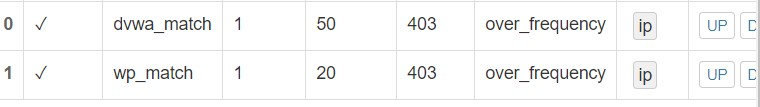
    - 超过访问频率限制的请求直接返回自定义错误提示信息页面-4
    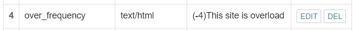
    - 禁止curl访问
    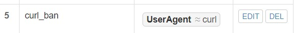


## 参考文献
- [VeryNginx详细配置说明](https://www.cnblogs.com/sanduzxcvbnm/p/11400349.html)
- [2021-linux-public-Zhang1933](https://github.com/CUCCS/2021-linux-public-Zhang1933/blob/ch0x05/ch0x05/ch0x05.md)
- [How to Install WordPress with LEMP on Ubuntu 20.04](https://www.digitalocean.com/community/tutorials/how-to-install-wordpress-with-lemp-on-ubuntu-20-04)