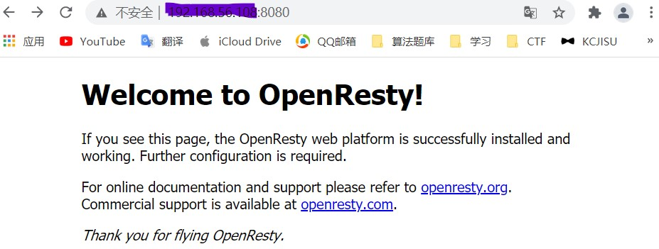

# 实验五 Web服务器的搭建
## 实验环境
- 主机：Windows10
- 虚拟机：ubuntu 20.04

## 实验配置
### 修改Windows的hosts文件
192.168.56.108 wp.sec.cuc.edu.cn
192.168.56.108 dvwa.sec.cuc.edu.cn

### Nginx
```
#安装nginx
sudo apt update
sudo apt install nginx -y
#验证是否安装成功
sudo nginx -t
```
访问主机80端口


### VeryNginx
```
#先关闭nginx
sudo nginx -s stop
#安装所需要的程序
sudo apt install -y libpcre3-dev libssl-dev zlib1g-dev gcc make unzip
#下载verynginx安装包
git clone https://github.com/alexazhou/VeryNginx.git
cd VeryNginx
#安装veryNginx
sudo python3 install.py install
# All work finished successfully, enjoy it~
#修改 /opt/verynginx/openresty/nginx/conf/nginx.conf 配置文件
sudo vim /opt/verynginx/openresty/nginx/conf/nginx.conf
# 将user从nginx修改为www-data
# 修改server监听端口为8006
# 保存退出
``` 
访问主机8006端口

-----------
输入用户名和密码```verynginx/verynginx```登入网站


### WordPress
```

#下载相关的库
sudo apt install -y mysql-server php-fpm php-mysql
#下载完成后进入mysql新建wordpress需要的用户和数据库
sudo mysql -u root -p

# 新建一个数据库wordpress
CREATE DATABASE wordpress DEFAULT CHARACTER SET utf8 COLLATE utf8_unicode_ci;

# 新建一个用户 刷新并退出
CREATE USER 'wordpressuser'@'localhost' IDENTIFIED BY 'password';
GRANT ALL ON wordpress.* TO 'wordpressuser'@'localhost';
FLUSH PRIVILEGES;
EXIT;

#安装php扩展

sudo apt install php-curl php-gd php-intl php-mbstring php-soap php-xml php-xmlrpc php-zip

sudo systemctl restart php7.4-fpm

#新建文件夹保存wordpress
sudo mkdir /var/www/html/wordpress/
#修改属主
sudo chown -R www-data:www-data /var/www/html/wordpress/

#下载wordpress4.7安装包
sudo wget https://wordpress.org/wordpress-4.7.zip
unzip wordpress-4.7.zip
sudo cp -r wordpress/* /var/www/html/wordpress/

# 拷贝配置文件
cd /var/www/html/wordpress/
sudo cp wp-config-sample.php wp-config.php
#获取个人密钥
curl -s https://api.wordpress.org/secret-key/1.1/salt/
#修改wp-config.php中的配置
sudo vim /var/www/html/wordpress/wp-config.php
#修改其中的个人密钥和database部分
define('AUTH_KEY',         'VALUES COPIED FROM THE COMMAND LINE');
define('SECURE_AUTH_KEY',  'VALUES COPIED FROM THE COMMAND LINE');
define('LOGGED_IN_KEY',    'VALUES COPIED FROM THE COMMAND LINE');
define('NONCE_KEY',        'VALUES COPIED FROM THE COMMAND LINE');
define('AUTH_SALT',        'VALUES COPIED FROM THE COMMAND LINE');
define('SECURE_AUTH_SALT', 'VALUES COPIED FROM THE COMMAND LINE');
define('LOGGED_IN_SALT',   'VALUES COPIED FROM THE COMMAND LINE');
define('NONCE_SALT',       'VALUES COPIED FROM THE COMMAND LINE');

define( 'DB_NAME', 'wordpress' );

/** MySQL database username */
define( 'DB_USER', 'wordpressuser' );

/** MySQL database password */
define( 'DB_PASSWORD', 'password' );
#添加
define( 'FS_METHOD', 'direct' );

#修改配置文件
sudo vim /etc/nginx/sites-available/wp.sec.cuc.edu.cn
server {
    listen 8001;
    server_name wp.sec.cuc.edu.cn;
    root /var/www/html/wordpress/;

    index index.php index.html index.htm index.nginx-debian.html;

    location / {
        #try_files $uri $uri/ =404;
        try_files $uri $uri/ /index.php$is_args$args
    }
    location = /favicon.ico { log_not_found off;access_log off; }
    location = /robots.txt { log_not_found off; access_log off; allow all; }
    location ~* \.(css|gif|ico|jpeg|jpg|js|png)$ {
        expires max;
        log_not_found off;
    }
    location ~ \.php$ {
        include snippets/fastcgi-php.conf;
        fastcgi_pass unix:/var/run/php/php7.4-fpm.sock;
     }
}
sudo ln -s /etc/nginx/sites-available/wp.sec.cuc.edu.cn /etc/nginx/sites-enabled/
sudo unlink /etc/nginx/sites-enabled/default

sudo nginx -t
sudo systemctl restart nginx
```

### DVWA
```
#登录MySQL
sudo mysql -u root -p

#为dvwa创建MySQL数据库
CREATE DATABASE dvwa DEFAULT CHARACTER SET utf8 COLLATE utf8_unicode_ci;
GRANT ALL ON  dvwa.* TO 'dvwauser'@'localhost' IDENTIFIED BY 'password';
FLUSH PRIVILEGES;
exit;
sudo systemctl restart mysql

#将DVWA源码clone到可写目录
git clone https://github.com/ethicalhack3r/DVWA 
#拷贝至/var/www/html
sudo mkdir /var/www/html/dvwa
sudo chown -R www-data:www-data /var/www/html/dvwa
sudo rsync -avP DVWA/ /var/www/html/dvwa
cd var/www/html/dvwa
cp /var/www/dvwa/config/config.inc.php.dist /var/www/dvwa/config/config.inc.php
# 更改配置文件
sudo vim /etc/nginx/sites-available/dvwa.sec.cuc.edu.cn
sudo ln -s /etc/nginx/sites-available/dvwa.sec.cuc.edu.cn /etc/nginx/sites-enabled/
server {
    listen 8005;
	server_name dvwa.sec.cuc.edu.cn;

    root /var/www/dvwa/;
    index index.php index.html index.htm index.nginx-debian.html;

    location / {
    try_files $uri $uri/ /index.php$is_args$args;
    }

    location ~ \.php\$ {
        include snippets/fastcgi-php.conf;
        fastcgi_pass unix:/run/php/php7.2-fpm.sock;
    }
}
vim /var/www/dvwa/config/config.inc.php
#/var/www/dvwa/config/config.inc.php  
$_DVWA[ 'db_database' ] = 'dvwa';
$_DVWA[ 'db_user' ]     = 'dvwauser';
$_DVWA[ 'db_password' ] = 'dvwa123';
$_DVWA[ 'recaptcha_public_key' ]  = public_key;
$_DVWA[ 'recaptcha_private_key' ] = private_key;

vim /etc/php/7.4/fpm/php.ini 
allow_url_include = on
allow_url_fopen = on
display_errors = off
# 重载nginx
sudo systemctl reload nginx
```
## 问题
```
cp: -r not specified; omitting directory 'wordpress/'
添加-r
sudo cp -r wordpress/ /var/www/html/wp.sec.cuc.edu.cn
```

## 配置文件

```
# /opt/verynginx/openresty/nginx/conf/nginx.conf
user  www-data;
worker_processes  auto;

#error_log  logs/error.log;
#error_log  logs/error.log  notice;
#error_log  logs/error.log  info;

#pid        logs/nginx.pid;


events {
    worker_connections  1024;
}

include /opt/verynginx/verynginx/nginx_conf/in_external.conf;

http {
    include       mime.types;
    default_type  application/octet-stream;

    #log_format  main  '$remote_addr - $remote_user [$time_local] "$request" '
    #                  '$status $body_bytes_sent "$http_referer" '
    #                  '"$http_user_agent" "$http_x_forwarded_for"';

    #access_log  logs/access.log  main;
    sendfile        on;
    #tcp_nopush     on;

    #keepalive_timeout  0;
    keepalive_timeout  65;
        client_body_buffer_size 128k;

    #gzip  on;

        #this line shoud be include in every http block
    include /opt/verynginx/verynginx/nginx_conf/in_http_block.conf;

    server {
        listen       192.168.56.108:8006;

        #this line shoud be include in every server block
        include /opt/verynginx/verynginx/nginx_conf/in_server_block.conf;

        location = / {
            root   html;
            index  index.html index.htm;
        }
    }
    
}
# /etc/nginx/sites-available/wp.sec.cuc.edu.cn
server {
    listen 8001;
    server_name wp.sec.cuc.edu.cn;
    root /var/www/html/wordpress/;

    index index.php index.html index.htm index.nginx-debian.html;

    location / {
        #try_files $uri $uri/ =404;
        try_files $uri $uri/ /index.php$is_args$args
    }
    location = /favicon.ico { log_not_found off;access_log off; }
    location = /robots.txt { log_not_found off; access_log off; allow all; }
    location ~* \.(css|gif|ico|jpeg|jpg|js|png)$ {
        expires max;
        log_not_found off;
    }
    location ~ \.php$ {
        include snippets/fastcgi-php.conf;
        fastcgi_pass unix:/var/run/php/php7.4-fpm.sock;
     }
}
```