# Chap0x06 shell脚本编程练习进阶
——FTP、NFS、DCHP、Samba服务器的自动安装与自动配置

## root用户ssh免密登录
```
#设置目标主机可以通过root进行ssh登录
sudo vim /etc/ssh/sshd_config
PermitRootLogin yes
StrictModes yes
PermitEmptyPasswords yes
PasswordAuthenticatlion yes
#重新设置目标主机root用户密码
sudo passwd root
#在工作主机生成ssh密钥
ssh-keygen
#将工作主机中生成的ssh密钥发送到目标主机中
ssh-copy-id -i ~/.ssh/id_rsa.pub root@192.168.56.114
#ssh免密登录目标主机root用户完成
```
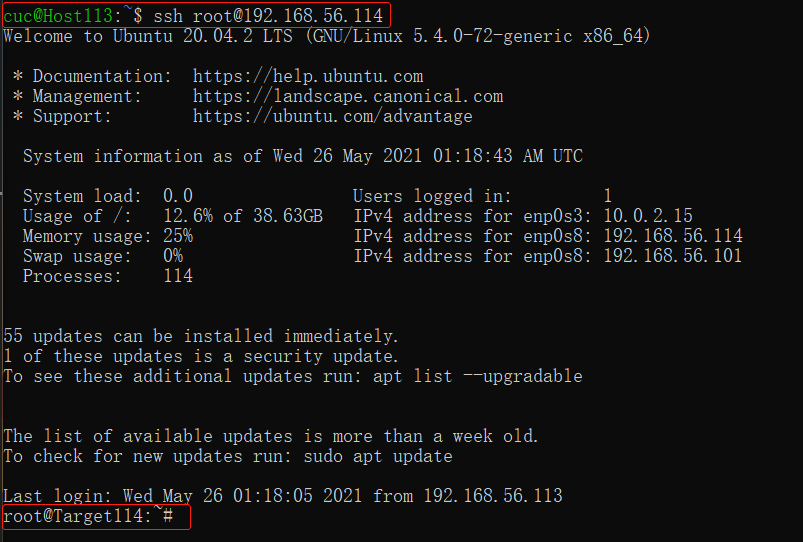

## FTP

### 实验工具
- vsfptd
易用性强且较为安全，性能和功能性也比较好，网上相关资料较多。

### 自动安装脚本

[vsftpd.sh](shell/vsftpd.sh)

### 实验内容

-  配置一个提供匿名访问的FTP服务器，匿名访问者可以访问1个目录且仅拥有该目录及其所有子目录的只读访问权限；
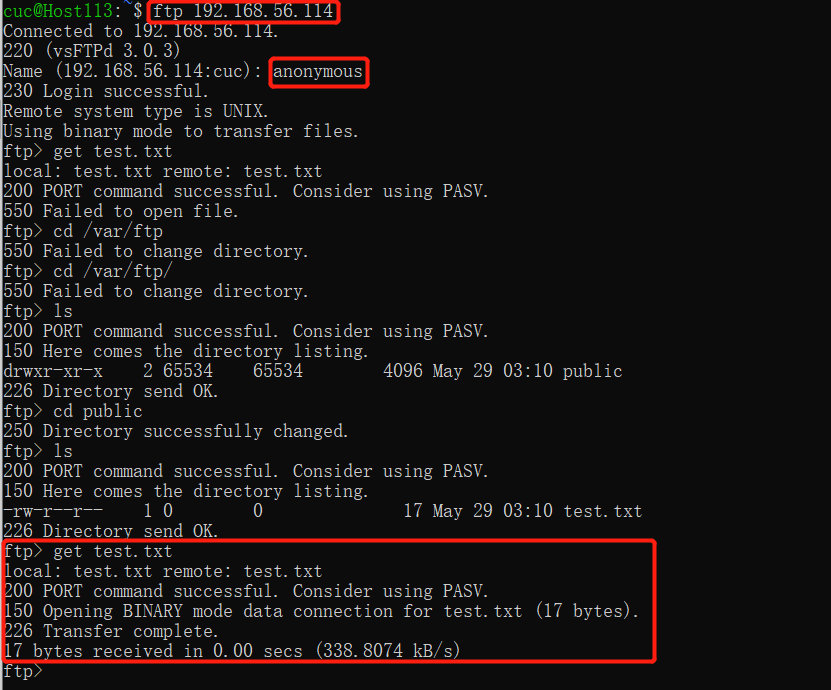
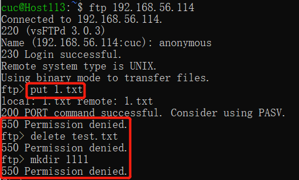

- 配置一个支持用户名和密码方式访问的账号，该账号继承匿名访问者所有权限，且拥有对另1个独立目录及其子目录完整读写（包括创建目录、修改文件、删除文件等）权限；
    - 该账号仅可用于FTP服务访问，不能用于系统shell登录；

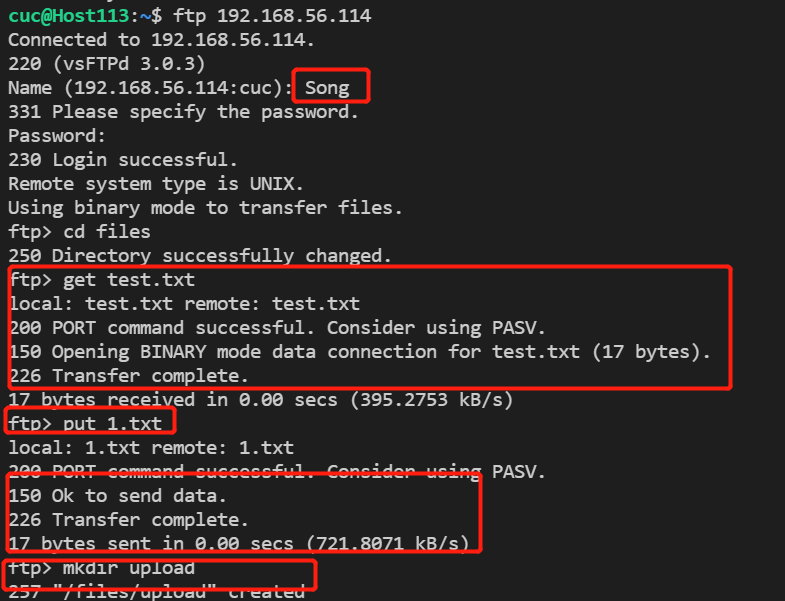

- FTP用户不能越权访问指定目录之外的任意其他目录和文件；
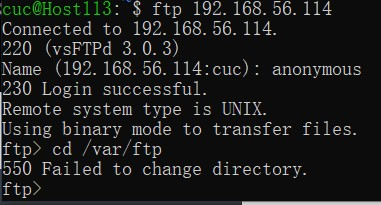

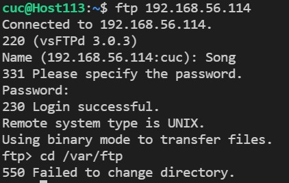

- 匿名访问权限仅限白名单IP来源用户访问，禁止白名单IP以外的访问；
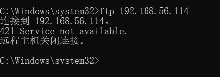


## NFS

### 自动安装脚本
[nfs_client.sh](shell/nfs_client.sh)

[nfs_server.sh](shell/nfs_server.sh)

- 在1台Linux上配置NFS服务，另1台电脑上配置NFS客户端挂载2个权限不同的共享目录，分别对应只读访问和读写访问权限；
```
NFS Server IP：192.168.56.113
NFS Clients IP：192.168.56.114
```

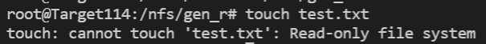
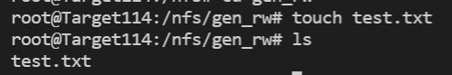

- 实验报告中请记录你在NFS客户端上看到的：
    - 共享目录中文件、子目录的属主、权限信息
    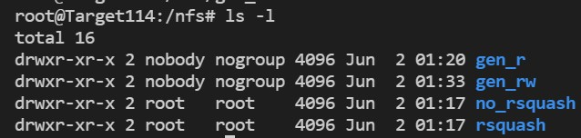
    - 你通过NFS客户端在NFS共享目录中新建的目录、创建的文件的属主、权限信息
    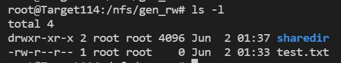
    - 上述共享目录中文件、子目录的属主、权限信息和在NFS服务器端上查看到的信息一样吗？无论是否一致，请给出你查到的资料是如何讲解NFS目录中的属主和属主组信息应该如何正确解读
    NFS服务器中的权限
    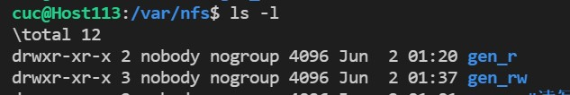
    与客户端中的权限和属主均相同。
    解读：NFS本身的服务并没有进行身份登入的识别。当你在客户端以 dmtsai 的身份想要存取服务器端的文件系统时， 服务器端会以客户端的使用者 UID 与 GID 等身份来尝试读取服务器端的文件系统。NFS server/NFS client 刚好有相同的账号与群组，则此时使用者可以直接以 dmtsai 的身份进行服务器所提供的文件系统之存取。


## DCHP

### 自动安装脚本
[dhcp.sh](shell/dhcp.sh)

### 实验内容

- 2台虚拟机使用Internal网络模式连接，其中一台虚拟机上配置DHCP服务，另一台服务器作为DHCP客户端，从该DHCP服务器获取网络地址配置
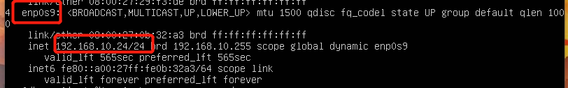
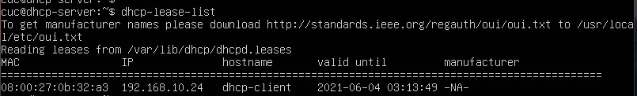

## Samba
### 自动安装脚本

[samba.sh](shell/samba.sh)

### 实验内容
- 分别查看基于 Windows 和 Linux 搭建 SMB 共享服务包含的共享目录清单
使用sambaclient查看Linux中共享文件夹目录
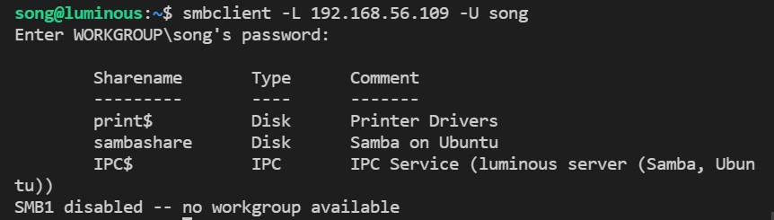

在win中添加共享文件夹（使用虚拟机）
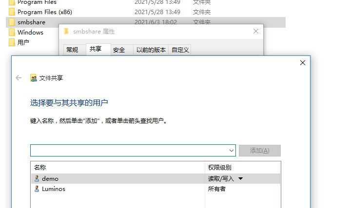
使用samba查看win中添加的共享文件夹目录
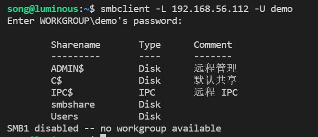

- 向远程共享目录上传文件和目录
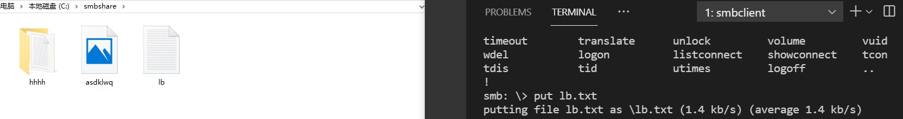
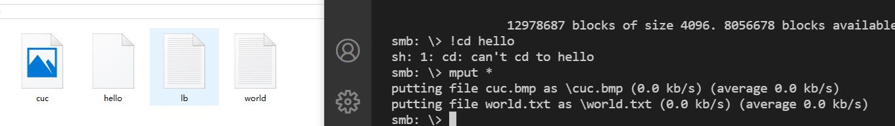
- 从远程共享目录中下载文件和目录
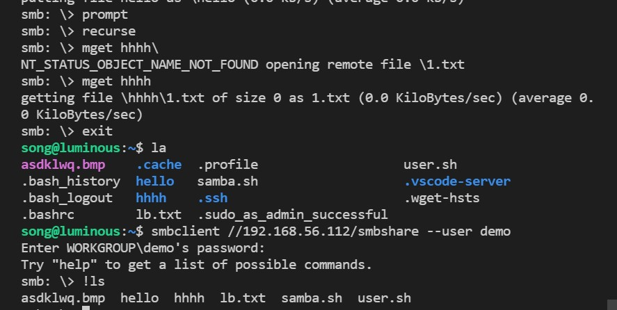
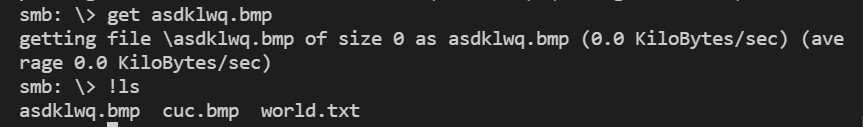

## DNS
- 基于上述Internal网络模式连接的虚拟机实验环境，在DHCP服务器上配置DNS服务，使得另一台作为DNS客户端的主机可以通过该DNS服务器进行DNS查询
- 在DNS服务器上添加 zone "cuc.edu.cn" 的以下解析记录
```
ns A <自行填写DNS服务器的IP地址>
wp.sec.cuc.edu.cn A <自行填写第5章实验中配置的WEB服务器的IP地址>
dvwa.sec.cuc.edu.cn CNAME wp.sec.cuc.edu.cn
```
服务器主机安装bind9：``sudo apt-get install bind9``

修改配置文件

    - options文件:
            listen-on { 192.168.10.21; }; 
            allow-transfer { none; }; 
            forwarders { 8.8.8.8; 8.8.4.4; };
    - local文件：   
            zone "cuc.edu.cn" { 
                type master; 
                file "/etc/bind/db.cuc.edu.cn"; 
            };
    - 生成db.cuc.edu.cn文件
            ;
            ; BIND data file for local loopback interface
            ;
            $TTL	604800
            @	IN	SOA	cuc.edu.cn. root.cuc.edu.cn. (
			              2		; Serial
			        604800		; Refresh
			        86400		; Retry
			        2419200		; Expire
			        604800 )	; Negative Cache TTL
            ;
    @	IN	NS	ns.cuc.edu.cn.
    @	IN	A	192.168.10.2
    @	IN	AAAA	::1
    ns.cuc.edu.cn.	IN	A	192.168.10.2
    wp.sec.cuc.edu.cn	IN	A	192.168.56.108
    dvwa.sec.cuc.edu.cn	IN	CNAME 	wp.sec.cuc.edu.cn.

目标主机重启Bind9: ```sudo service bind9 restart```

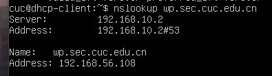

## 参考资料
- [Linux下FTP Server评估（vsftpd、pure-ftpd、proftpd)转](https://www.cnblogs.com/zhaoyang-1989/articles/3453408.html)
- [How to setup FTP server on Ubuntu 20.04 Focal Fossa Linux](https://linuxconfig.org/how-to-setup-ftp-server-on-ubuntu-20-04-focal-fossa-linux)
- [CUCCS/linux-2020-LyuLumos](https://github.com/CUCCS/linux-2020-LyuLumos/blob/ch0x06)
- [How to Install and Configure an NFS Server on Ubuntu 20.04](https://linuxize.com/post/how-to-install-and-configure-an-nfs-server-on-ubuntu-20-04/#installing-the-nfs-server)
- [解决mount.nfs: access denied by server while mounting](http://www.pooy.net/address-mount-nfsaccess-denied-by-server-while-mounting.html)
- [How to Setup DHCP Server in Ubuntu Server 20.04](https://devtutorial.io/how-to-setup-dhcp-server-in-ubuntu-server-20-04.html)
- [Samba 安装与配置，以及配置说明参数详解](https://www.jianshu.com/p/f7fb4ad09c11)
- [How to configure Samba Server share on Ubuntu 20.04 Focal Fossa Linux](https://linuxconfig.org/how-to-configure-samba-server-share-on-ubuntu-20-04-focal-fossa-linux)
- [smbclient - Send all files in directory](https://stackoverflow.com/questions/38890480/smbclient-send-all-files-in-directory)